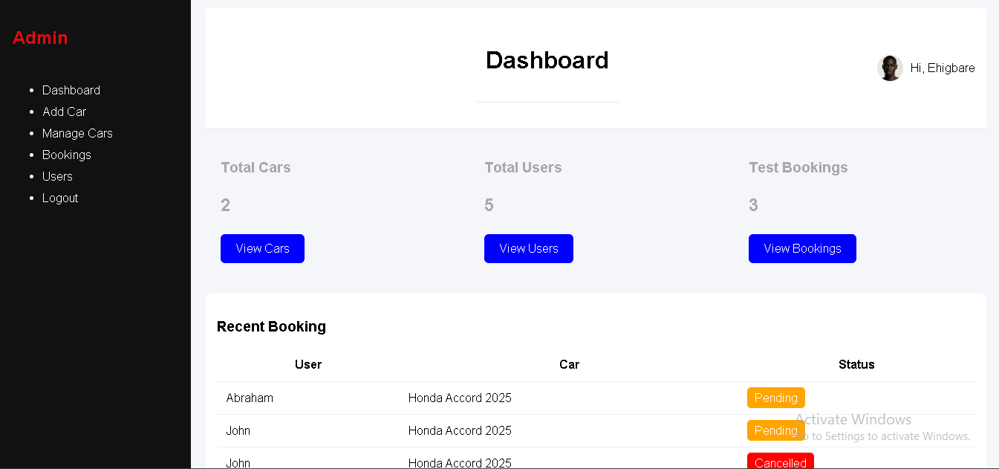
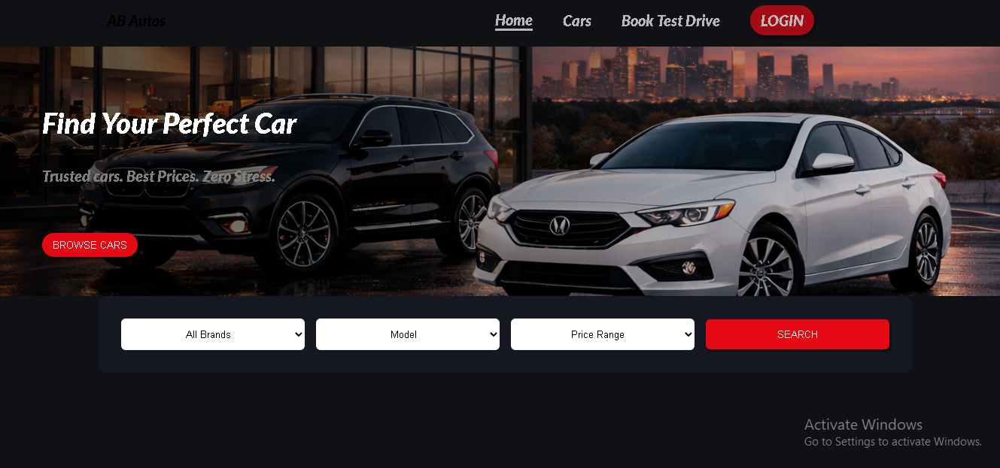

# AB AUTOS - Car Dealership Management System

**AB AUTOS** is a full-stack web application desingned to streamline car dealership operations. It provides a seamless experience for customers to browse inventory and a robust dashboard for administrators to manage car listings and bookings.

---

## Key Features

- **Inventory Managemrnt:** Full CRUD(CREATE, READ, UPDATE, DELETE) functionality for administrators.
- **Dynamic Search:** Real-time filtering by brand, price range, and availability.
- **Ajax Shopping Cart:** Add cars to a wishlist/cart without page refreshes for a modern UX.
- **Test Drive Booking:** Integrated scheduling system for potential buyers.
- **Responsive Design:** Fully optimized for mobile, tablet, and desktop viewing.

---

## Tech Stack

- **Frontend:** HTML5, CSS3, Javascript(Vanilla ES6)
- **Backend:** PHP 8.x
- **Database:** MariaDB/MySQL
- **Version Control:** Git & GitHub

---

## Project Structure

├── admin/          # Management dashboard and car upload logic
├── assets/         # CSS styles, JavaScript files, and UI images
├── config/         # Database connection (db.php)
├── controllers/    # AJAX handlers and form processing logic
├── includes/       # Reusable components (header, footer, nav)
├── public/         # User-facing pages (inventory, details, login)
├── uploads/        # Directory for uploaded car images
├── dealership_app.sql      # Updated Database schema for easy setup
└── database.sql    # Database schema for easy setup

---

